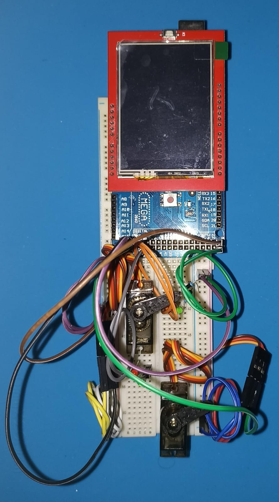

# LOCK DOOR
---

**Instituto Federal de Educação, Ciência e Tecnologia - câmpus Itajaí**

Projeto desenvolvido para obtenção de nota na disciplina de Microcontroladores do curso de Engenharia Elétrica.

---

**Sumário:**
- [LOCK DOOR](#lock-door)
  - [Baixe esse projeto](#baixe-esse-projeto)
  - [Dependências](#dependências)
  - [Observações](#observações)
  - [O projeto](#o-projeto)
    - [Materiais utilizados](#materiais-utilizados)
    - [Montagem](#montagem)
    - [Resultado](#resultado)

---

## Baixe esse projeto:
baixe o arquivo `.zip`
ou
~~~bash
git clone https://github.com/GTCav/lock_door.git
~~~

## Dependências:
* lock_door (desenvolvida nesse projeto)
* [Adafruit GFX](https://github.com/adafruit/Adafruit-GFX-Library?utm_source=platformio&utm_medium=piohome)
* [Adafruit BusIO](https://github.com/adafruit/Adafruit_BusIO?utm_source=platformio&utm_medium=piohome)
* [Adafruint_TouchScreen](https://drive.google.com/file/d/1-MenyNZYpaYNXE7J1X6nF1KwWgq6mDR1/view)
* [MCUFRIEND_kbv](https://drive.google.com/file/d/1-RBBiyWD2t3Aj1jTboeYKy7ejp7Irb8R/view)
* [Servo](https://www.arduino.cc/reference/en/libraries/servo/?utm_source=platformio&utm_medium=piohome)

## Observações:
Esse projeto foi desenvolvido no editor de texto [*Visual Studio Code*](https://code.visualstudio.com/) e foi feito uso da extensão [*PlatformIO*](https://platformio.org/) para compilação e *upload* do código.

## O projeto:
### Materiais utilizados:
* Arduino Mega 2560 ATMega 2560
* 2.4" TFT LCD *Shield*
* Micro servo MG90S
* *Protoboard*
* Fonte chaveada 12 V (utilzada para o arduino)
* LEDs para sinalização

### Montagem:
* #### 2.4" TFT LCD *Shield*:
O *shield* é acoplado ao Arduino Mega respeitando a posição dos pinos do Arduino Uno.

* #### Circuito restante:
O restante do circuito é montado conforme a figura a seguir:

* #### Circuito final:
 

### Resultado:

    
    

    
    

    

